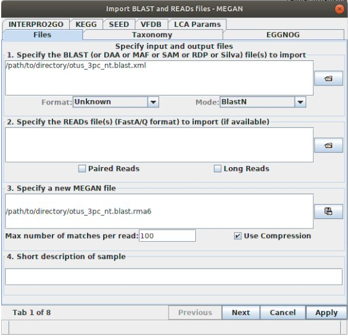

.. _id_using_megan:

======================================
1. Classification with GenBank & MEGAN
======================================

.. toctree::
	:hidden:

	extensions/megan_settings

Introduction
============

The most straightforward automated way of assigning taxonomy to OTUs is to BLAST the OTUs against the GenBank nucleotide database, and then process the results using a Lowest Common Ancestor algorithm. This process looks at the taxonomy of all of the results for a single sequence and estimates what taxon is the most likely Lowest Common Ancestor for all of the results, assigning the sequence that taxon. This is implemented in the program MEGAN.

GenBank databases
=================

To BLAST against GenBank on your own machine you will need a copy of the GenBank nucleotide (nt) database. You can find out how to do this `here <ftp://ftp.ncbi.nlm.nih.gov/blast/documents/blastdb.html>`_

If you are running with the example data, we have created a mini version of the nt database designed to rapidly produce results *for this dataset only*. You can download and extract this into your working directory with the following commands:

.. code-block:: bash
	
	wget
	tar -xvzf
	

Running BLAST
=============

Select one of your OTU files and blast it against nt using the following command:

.. code-block:: bash 
	
	$ blastn -db blastdb/nt -query ​in.fasta​ -outfmt 5 -out ​out.xml​ -evalue 0.001

This command generates a very large XML file containing the full record of all the alignments BLAST has found for our OTUs. We need to transfer this to our computer for the next step, but to save bandwidth, let’s first compress the xml using zip:

.. code-block:: bash

	$ zip ​out.xml.zip in.xml

Using your FTP client, or whatever file transfer method you like, transfer the zipped XML file to your computer and extract it.

Running MEGAN
=============

We will use MEGAN to parse the BLAST results and assign taxonomy to our OTUs. This is one of many algorithms out there for doing this - we introduce it here because it has a handy GUI interface and you’re probably bored of looking at the terminal.

Open up MEGAN. It usually takes a little while to open because it has to load the entire NCBI taxonomy into memory and display it. I bet you miss the efficiency of the terminal already.

MEGAN works through each OTU and find the location on the NCBI taxonomy tree for each GenBank sequence the OTU had a hit against. It then uses the LCA algorithm to assign taxonomy to each OTU.

Once MEGAN has opened and loaded the tree, you should see a very high-level cladogram of living organisms. This is the entire NCBI taxonomy. To map the OTU BLAST data onto this, you need to load the XML. Go to ​:menuselection:`File --> Import From BLAST​`. In the Files tab of the window that appears, use the button to the right of the first box to browse to and select your XML file. MEGAN will automatically fill the third box. It should look something like this:

Go to the ​LCA Params tab at the top. Here you will see the parameters that MEGAN uses when assigning taxonomy using its lowest common ancestor algorithm. For now we'll leave these as default and just press Apply​.

Once MEGAN has finished you should see a reduced version of the taxonomy tree. It may not be very detailed: at the top bar, select :menuselection:`Rank` and choose :menuselection:`Species`. Have a look at the tree.

:guilabel:`Are all the OTUs Coleoptera?`

Each circle on the tree is one or more OTUs that have been assigned to a node. The larger the circle, the more OTUs have been assigned to that node. If you click on a node, you’ll see two values. ​:menuselection:`Assigned` is the number of OTUs assigned to that node, :menuselection:`Summed` is the number of OTUs assigned to that node and all child nodes. If you ​right click on a node and click :menuselection:`Inspect`, you can see more details about that node and the OTU(s) assigned to it, as well as all the BLAST information. The greyed out BLAST hits are those that aren’t taken into account in the LCA analysis.

.. admonition:: Exercise
	
	You’ll notice that many OTUs have been assigned to internal nodes (i.e. not species). Inspect some of these.
	
	* Why do you think the algorithm has assigned them to internal nodes?
	
	* Do you think algorithm is always correct?

To output the taxonomic assignment for all of the OTUs for use in analysis, we need to select all of the nodes. You can do this by going to :menuselection:`​Select --> All Nodes`​. Then go to :menuselection:`​File --> Export --> Text (CSV) Format​`. For the :menuselection:`Choose data to export:` field, select ​:menuselection:`readName_to_taxonPath​`, click OK and select your output location. This generates a comma-separated table with the OTU name and full NCBI taxon path of the assigned node.

Next Steps
==========

The major downside to this method is that it relies on GenBank being a) comprehensive and b) accurate. Some OTUs may be able to be classified to family or genus level if that family or genus is well represented in GenBank (for the locus we're using) and the identifications of the sequences on GenBank are both accurate and complete to the necessary taxonomic level. However, many other OTUs may not be able to be classified below the class or order level if there are insufficient close sequences available to match to, or if the available sequences are incorrectly identified or identified only to the class or order level. 

These impact of these issues can be somewhat ameliorated with careful tweaking of some of the LCA settings. If you want to experiment with different LCA settings in MEGAN, you could look at the :ref:`Extension: MEGAN LCA parameters <megan_settings>`

To deal with the accuracy issue, you could use a curated database. These are usually subsets of GenBank that have carefully checked the accuracy of the taxonomy for a subset of sequences, usually based on a specific locus. We look at how to use one of these, with a variety of different classification methods, in the next subsection: :ref: `2. Classification with Curated Databases <id_curated>`.
